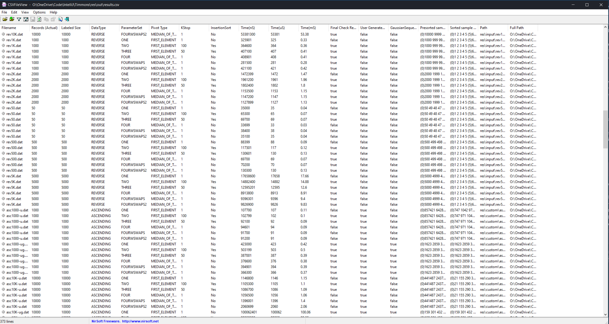
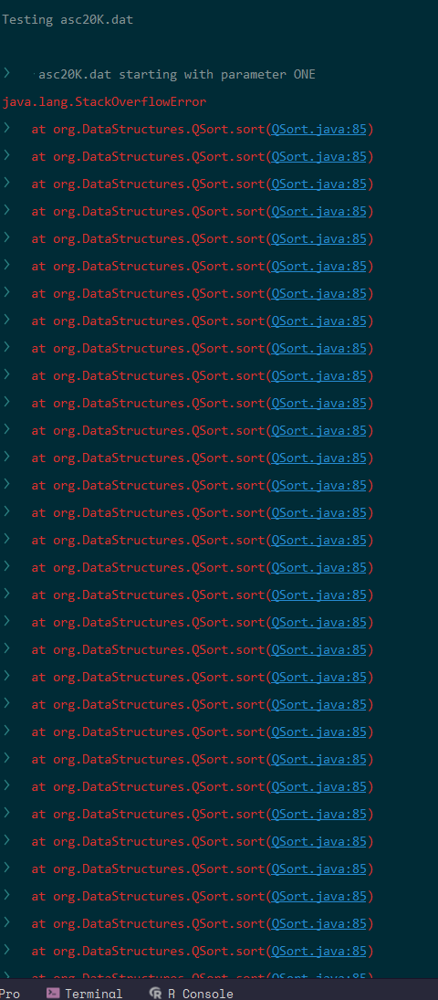
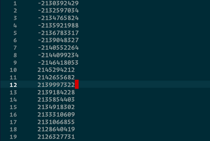

Data Structures
Project 4
May 4, 2020

# An indepth comparison of Quicksort, Heap sort, and  Insertion Sort.

[[TOC]]

## Introduction

In this lab we take a look at the relative time it takes to sort a data set of various sizes using insertion sort and quick sort.

## Project Structure

## Review of Concepts

## Programmatic Stucture

The sorting types are given here.

!!!info Sorting Conditions

      • Select the first item of the partition as the pivot. Treat a partition of size one and two as a stopping case.
      • Select the first item of the partition as the pivot. Process down to a stopping case of a partition of size k = 100. Use an insertion sort to finish.
      • Select the first item of the partition as the pivot. Process down to a stopping case of a partition of size k = 50. Use an insertion sort to finish.
      • Select the median-of-three as the pivot. Treat a partition of size one and two as a stopping case.

To implement this, I created an enum - QSParam to store the values for this.  It seemed appropriate and allows easily iterating over the set.  I didnt have good methods for these, so I simply called them ONE, TWO, THREE, FOUR:


!!!note This is an early version of the Enum Method.
    ```java 
          public enum QSParams{
        //numberMethod(pivotMethod, Kstop)
        ONE(1, 1),
        TWO(1, 100),
        THREE(1, 50),
        FOUR(3, 1);
        
        private final int pivotMethod;
        private final int kStopValue;
        private QSParams(int pivotMethod, int kStopValue){
          this.pivotMethod = pivotMethod;
          this.kStopValue = kStopValue;
        }
      
        boolean getPivot( ){
          return (pivotMethod == 1);
        }
      
        int getkStopValue(){
          return kStopValue;
        }
      
      }

    ```
I noticed while resarching this, there were a few different methods for the Median of Three Method.

The obvious one is simply to calculate the middle :  

      int mid = (high + low) /2;
      pivot = mid;
      pivotValue = data[mid];

And thats what I initially did.  Yet, thats not the *median*.  Its just the *middle*, which is totally different.  So then we need to come up with the median value.  I played with like 10 different ways to efficiently calculate the median, way too long to be honest.  The way I came up with was this:

!!!note Side Note:
    I wanted to implement this with more advanced Java techniques, to push my understanding of the language.  So I implemented several Enums (when called for), and a functional interface, for Pivot, as that was most appropriate for this situation.  While on this first stab at it, it took vastly longer to implement as there was lots and lots (and lots) of trial and error, I did eventually do that.  More on that in a bit, but it explains the following code blocks, which follow from:

      From [[QSParams.enum]]
      ```java 
         public interface Pivot{
            int pivot( Integer[] data , int low , int high );
         }
      ```
 

```java 
  Pivot func_MedofThree_calcNGo =  ( Integer[] dd , int lo , int hi ) -> {
    int mid = ( lo + hi ) / 2,
          h = dd[ hi ],
          m = dd[ mid ],
          l = dd[ lo ],
          x = Math.max( h , m ),
          y = Math.max( l , m ),
          z =( x == y ) ? Math.max( h , l ) : Math.min( x , y );
    return ( z == h ) ? hi : ( ( z == m ) ? mid : lo );
  };
```
From [[QSParams.enum]]

Its a bit hard to follow, because of the ternary expressions and honestly I think I fall into the same trap everyone falls into where terse statements are equated with *fast* statements.  But in many ways, thats a bit like putting a spoiler on a minivan.  It might make it look fast, but it doesn't mean much. Probably comes from the javascript minifiers (where all the names are replaced with single letters to shrink the number of bytes in a website size to make it load faster-- when in reality its not the varible names, its the scores of tracking scripts that are slowing it down.)

From there, when I was looking into some Quicksort history, I saw some discussion on the pivot, stating with the *pseudomedian of nine*, which converted into the median of three.  There they went ahead and made the swaps.  If you are going to do the comparisons, you may as well swap now. This is just a few fewer swaps to make in the long run.

Then the question was, do you swap the median to be in the middle:


```java 
   class PivAlt2 extends PivotMo3 implements Pivot {
      @Override
      public int pivot( Integer[] data , int low , int high ){
         QSort qsInstance = QSort.getInstance();
         int mid = ( low + high ) / 2;
         if(data[mid] < data[low]) qsInstance.swap( low , mid );
         if(data[high] < data[low]) qsInstance.swap(low , high );
         if(data[high] < data[mid]) qsInstance.swap(mid , high );
         return mid;
      }
  }
  
```
   From [[QSParams.enum]]

which makes intuitive sense, but at the same time the placement is rather ambiguous (what if > 50% of the elements are less than the pivot), something that should presumably happen more than half the time (since the pivot is >= and the low side is just < ).

The solution to that, is to go ahead an put the pivot on the high side, where it will end up in the vast majority of cases.


```java 
  Pivot func_MedofThree_swapHi =
        ( Integer[] data , int low ,  int high ) ->
        {
          QSort qsInstance = QSort.getInstance();
          int mid = ( low + high ) / 2;
          if(data[mid] < data[low]) qsInstance.swap( low , mid );
          if(data[high] < data[low]) qsInstance.swap(low , high );
          if(data[mid] < data[high]) qsInstance.swap(mid , high );
          return high;
        };
```
From [[QSParams.enum]]

Returning to the rest of the sorting parameters- the enum class [[QSParams]] contains these rules:

```java 
public enum QSParams{
  //numberMethod(pivotMethod, Kstop)
  ONE(PivotMethods.FIRST_ELEMENT, 1, false),
  TWO(PivotMethods.FIRST_ELEMENT, 100, true),
  THREE(PivotMethods.FIRST_ELEMENT, 50, true),
  FOUR( PivotMethods.MEDIAN_OF_THREE, 1, false),
  FOURWSWAPS( PivotMethods.MEDIAN_OF_THREE_WITH_SWAPS,1, false); 
  //end enum Declaration
  

   /*Fields*/
  private final int kStopValue;
  private final boolean doInsertSort;
  private final PivotMethods pivotMethod;
  

  
  /**
   * The default Constructor for this Enum.
   * @param pivotMethod 
   * @param kStopValue
   * @param doInsertionSort
   */
  private QSParams( PivotMethods pivotMethod, int kStopValue, boolean doInsertionSort ){
    this.pivotMethod = pivotMethod;
    this.kStopValue = kStopValue;
    this.doInsertSort = doInsertionSort;
  }
  
  Pivot getPivot(){
    switch( pivotMethod ){
      case MEDIAN_OF_THREE:
        return func_MedofThree_swapHi;
      case MEDIAN_OF_THREE_ALT:
        return func_MedofThree_swapMid
        
      case MEDIAN_OF_THREE_WITH_SWAPS:
        return func_MedofThree_calcNGo;
      default:
      case FIRST_ELEMENT:
        return func_pivotOnFirstElement;
    }
  }
    
  
  int getkStopValue(){
    return kStopValue;
  }
  
  
  /**
   * Getter for property 'doInsertSort'.
   *
   * @return Value for property 'doInsertSort'.
   */
  public boolean isDoInsertSort(){
    return doInsertSort;
  }
  
  private enum PivotMethods{
*     FIRST_ELEMENT,
    MEDIAN_OF_THREE,
    MEDIAN_OF_THREE_WITH_SWAPS;
    
  }
  
}
```

Since all my settings were contained in QSParams, I could go back to the [[GArrayList<DataSet>]] class, and which implemented iterable, and iterate over the [[DataSets]] very efficiently (and presumably _in parallel_) and then within that, iterate over the Enums, very efficiently, replacing the methods in question through the functional interfaces as needed.

This should create a maximally efficient application of this. In addition, it creates clear and easy to edit points to change the parameters of the program.  Additional sort methods could be added by simply dropping in a stand-alone class, adding two lines for a functional interface to tie it together, and one line to the Enum definitions.  Then they will be added to scheduled tests.

The Testing method takes an array of QSParams `public void test(QSParams ... qsParams)` in [[DataSet]] and iterates over that enum effecting that test.  It makes this program much more modular and avoids the spaghetti method call mess that my last programs utilized.

```java 
   public void test(QSParams ... qsParams){
      if(qsParams == null) qsParams = QSParams.values(); 
        for(QSParams param : qsParams){
         QSort qSort = new QSort( this, param);
        }
   }
```


An Enum Map is faster than a Hash map- it can be optimized at the outset, since all the possible Keys are declared in advance (The Enum.getValues() = <E>[])

Declaration is a bit weird

`  private EnumMap<QSParams, Long> timeResult=
        new EnumMap<QSParams, Long>(QSParams.class);`

but it reassures me that the way I had to initialize GArrayList by passing the Parameterized type as a class in the constructor is the right way.  Its always reassuring when the guys who made Java have to rely on the same method.

Since we are performing the test by iterating over the params, we can just store this value by calling:

      timeResult.put( param, simpleTimer.getResult() );

Initially I had started to create a series of Maps, each storing some aspect of the test result.  But then accessing each of those maps would have been a pain.  I threw together a quick inner class to encapsulate the data I wanted to chunk around in one piece.

```java 
  private class Results{
    String file = getDescriptor();
    int length = getSize();
    QSParams params;
    long startTime = -1;
    long endTime= -1;
    long time=-1;
    Boolean testTestResult = null;
    Integer[] sortedArray;
  
    Results(){}//empty constructor
    
    
    Results(QSParams params){
    }
    //todo make toString()?
   }
```
Because the declaration is enclosed in the Dataset class, and thus within the dataset instance, some of the fields are immedietly available in the enclosing class.  This may seem pointless, but I intend for these objects to be returned outside of this class, at least to a static class for producing a .csv file, where they will need to be identified.

Now I can simply instantiate the Results object inside the loop.  Since we will drop reference to it on the next pass of the loop, it makes sense to replace the EnumMap with this.  Now getting any result once run is trivial, and updating what is stored is also trivial.

EnumMap is updated to:

```java
  private EnumMap<QSParams, Results> timeResult=
        new EnumMap<QSParams, Results>(QSParams.class);
```

And the [[Reporter]] class, instead of taking each parameter individually, can take 1 object, and lookup all the values for making the CSV output file there.

```\java 
      //store the result and continue loop
    result.put( param, results );
  //send to reporter
    Reporter.report( results );
```

The reporter class was a rather useful class in the end.  Writing a CSV file is programatically easy.  I made a list of Field Names in an array, and also applied `String.join(String[], delim=" ,") + "\n"` to create each record. Adding additional fields to the [[Reporter]] wrapper and then adding them to the output was trivial.  

In addition, I paired this with a very lightweight bit of freeware by `NirSoft` (Nir Sofer), who has an indespensible set of tools to use for computer administration.  I use these tools more than the `SysInternals` tools (which are now part of Microsoft).  I should give a brief caveat with NirSoft's software suite, some of his tools recover Microsoft passwords that are stored in insecure places (as well as revealing a great deal else about the inner working of Windows.)  Due to an ongoing feud with Microsoft over whether he is entitled to reveal these passwords (the user has to elect to down load and run them), and it's up to Microsoft to implement better security practices to prevent it, and the ostensible valid use case (legitimate recovery of forgotten passwords), and Microsoft's disagreement, if you get one of the 8 or so tools (of ~100) that deal with this, the built in Windows Virus software will light up like a Christmas tree and act like it just saved you from the world ending.  However, I have used the software for years, and have found it to be 100% fine.  Better than fine, incredibly useful.

Each of his programs typically does one small thing.  Which in some ways is a bit irritating, as you have to remember which tool does what.  But on the the other hand, he follows the rule of do one thing really well and leave all the rest out.  All the above is a rather prolonged segue into CSVViewer_64.exe, which I have included.  It makes looking through the results of the program quick and easy, and in most instances, avoids having to pull the data into excel, or try and scope the program to run only a single file.  The data can be sorted and the columns rearranged, but thats about it.  It is a very simple program.  

I opted for CSV instead of something more in vogue like XML, or YAML, which I find both of those incredibly cumbersome, and JSON, which is better, because CSV really suits tabular flat data really well.  And while something like JSON can handle it fairly well, its a bit more complicated to write.  Nobody wants to look through XML by hand, even though Java natively seems to prefer XML.  




I use the DecimalFormat class to automatically format the values to correct number of significant digits.  I was suspicious at first, since converting from nano-seconds to micro-seconds and milliseconds, semmed to drop to the number of decimal points every time.  I think what is actually going on is that the JVM nano-seconds timer lacks the precision it claims.  This makes some sense, as the OS timer, has microsecond precision, while the JVM claims nanosecond precision.  The JVM is running on the OS.  While there are fractional Microseconds returned, these are rarely significant.

!!! Bug Bug or possible error. 
    The Reporter class chokes a bit if the folder `.\out\` doesnt exist and while I put in code to allow it to create the folder if needed, *and* the `File.createNew()` documentation states that intervening paths are created automatically, I found this to be untrue.  I believe that something in the IDE imparts or causes the JVM to inherit security descriptors that prevent the creation of directories in the root project.  Something that makes intuitive sense, I suppose, as each of the folders in the project has a specific purpose and is managed by the IDE.  If you receive an error, easiest may be just to create the directory and continue.  In addition, to mitigate the issue, I moved the output directory to the resources folder.


While this [[Reporter]] class worked well for what I needed, and there was no reason to go back and redo it, in retrospect, I think what I would have done is to create a map that contained a Key (the header), and a functional interface (some Lambda function or something implementing some interface that returns a string) such that:

```java
class Report extends FileWriter{
  private HashMap<String, Reporter> reportingModules = new HashMap<String, Reporter>();

  interface Reporter{
    String report();
  }

  Report(File file){
    super(File);
    //add values
    super.write(String.join(reportingModules.keys, ", "));
  }
  void write(Result result){
    //iter through functional interface.
  }
}
```

This would be a nice way in the future to make this extensible and dynamic.  Different reports could be generated as needed.

In addition, Javascript, and something I am more familiar with **R** both have robust data visualization libraries.  While I am sure they exist in Java, and the [[Streams]] I worked with on Data Generation seemed promising for data manipulation, I don't believe I have any realistic time left with this project.


### Issues with overflow



When running my program, I would get inconsistent errors of Stack Overflow.  They would not occur  each time, and as one might expect, it is (generally) the Ascending20K.dat file that overflows.  In some less common cases, the 10K files would overflow. The ascending file has a massive number of frame counts- at least 20,000.  The other files complete successfully, but the size on this one must be just around the maximum size for what the JVM can handle.

There are some JVM settings that can be used to really help mitigate this.  This is documented here [Java Tools Reference](https://docs.oracle.com/en/java/javase/11/tools/tools-reference.pdf) in section 2-6 for *javac.exe* or 2-53 for the JRE *java.exe*.  

There are several pertinent settings, most notably:

    -Xss - Sets the thread stack size (in bytes). 

    -Xmx - Specifies the maximum size (in bytes) of the memory allocation pool in bytes. 
    
    -Xmn Sets the initial and maximum size (in bytes) of the **heap** for the young generation (nursery).

    -Xms - Sets the initial size (in bytes) of the heap.

These, and any value, can be made implicit in the compiler for the program by setting the `J`*option* command :
        -JoptionPasses option to the runtime system, whereoption is one of the Java options de‐scribed on javacommand. For example, -J-Xms48m sets the startup memory to 48 MB.
    So that the resulting compiled program will contain these settings.  I set this value in the maven build settings and it resolved overflow issues. 


Initially, I thought I was helping by setting the value to `-Xss4M -Xms32M -Xmx128M -XshowSettings` as that resolved the problem.  Digging a bit deeper, I discovered, that without this setting, my maximum heap size (`-Xmx`) was by default, 16G, so this value was 128 *times* lower than the default.  In the end, the significant value was `-Xss`, the thread stack size, which makes sense as this allows the application to recurse deeper and deeper, keeping more values on the stack.  


Adding this parameter entirely resolves the issue.  It's not entirely clear what the default Thread Stack size is for the JVM.  Running the JVM with the setting `-XShowSettings` parameter enabled returns the following:

      VM settings:
          Max. Heap Size (Estimated): 15.98G
          Using VM: Java HotSpot(TM) 64-Bit Server VM

      Property settings:
          awt.toolkit = sun.awt.windows.WToolkit
          file.encoding = UTF-8
      <and around 100 more lines>

Only the first 2 lines are related to the JVM.  I suppose using HotSpot I could determine this, but I don't have experience using this program, and don't think this is the best time to work on this.  I then set about trying to figure out how to take this from an IDE parameter that is passed to the Java Application itself at runtime, without requiring the user to enter it.  I initially investigated the Java Properties class, but that seemed to take me in a different direction then what I was looking for.  With the exception of some built in classes, this was generally an opened ended implementation for settings storage.


Maven, continuing their long history- for me at least, of unintelligible documentation, really made me work for how to implement this, without requesting that a grader (if any in fact ever sees this) implements these options without having to type them.  I did eventually find the relevant settings here:

[Maven Compiler Arguments Documentation](https://maven.apache.org/plugins/maven-compiler-plugin/examples/pass-compiler-arguments.html)

with the correspoinding POM addition:

```xml
                    <artifactId>maven-compiler-plugin</artifactId>
                    <version>3.8.0</version>
                    <configuration>
                        <compilerArgs>
                            <arg>-J-Xss4M</arg>
<!--                            <arg>-J-Xms32M</arg>-->
<!--                            <arg>-J-Xmx128M</arg>-->
<!--                            <arg>-J-Xmn8M</arg>>-->
                        </compilerArgs>
                    </configuration>
```


This brings up a discussion of the `Recursive` vs. `Iterative` methods of this implementation.  I had a hard time coming up with a reasonably clean method of running though the files.  It seemed to create a huge number of loops, or require keeping track of the sorted areas and unsorted areas.  I suppose there may be a method that I am missing.  I was not able to come up with something for myself.


## Data Storage


I tried a few things before I settled on something that I liked for this method.  First I wrote the [[RecordSet]] class which basically wraps an [[Integer]] array, and contains a number of the supporting methods for typical operations.

  


DataSet extends RecordSet to add 3 important functionalities, the first the File Reading and nameing methods. RecordSet only handles the actual data, DataSet Loads and applies that data given a fileName or path. 

To load the files, I create a fileStream from the two directories, and pass the files to DataSet. This loads all the files in a directory, read each one and add the data to an array of Integers. Returns a wrapper for the array,

Finally, it drives the testing, storing the results, and handling the timer. This way the results are encapsulated with the data.  As is discussed further on, the enum DataType stores the types of data.  The GArrayList<T> stores all the DataSets and you can filter that stream to get subsets of data as needed.

In addition, DataSet implements theIterableinterface and the contains two sub-classes that provide the [[ListIterator(Integer)]] and the [[Iterator(Integer)]] interfaces.  


[[GArrayList]] really should have been the super for [[RecordSet]] -> [[DataSet]], but I wrote them separately and they sort of converged. I wrote [[RecordSet]] first to store the array of data and handle adding, removing, resizing, subsetting, formatting, etc. an array of Integers.

[[GArrayList]] was written after, and is essentially the same thing, many of the ideas in one were implemented in the other. And in truth, by the end, [[GArrayList]] could have completely replaced RecordSet. RecordSet is an Integer implementation of [[GArrayList]].  The class was really an experimentation with Generics, as I wanted to include some practice with Generic typing in this assignment.  So the implementation is fully Generic.  Which, incidentally, is where the name comes from _**G**_eneric_**ArrayList**_ and *ArrayList* was already taken.


## Sorting

Some of the issues I ran into included not having the one of the iterators equal to the pivot.  

In otherwords, 

```java
while(true){
  
      while(data[start] < pivotValue){
      // while(data[start] <= pivotValue){
        start += 1;
      }
  
      while(data[end] > pivotValue){
        end -= 1;
      }
  
      if(end - start <=  kStop) {
        break partition;

      }else{
        //the pointers have met or crossed.
        data = swap(data, start , end );
        start += 1;
        end -= 1;
      }
    }
```

as above in line 3+4.  This created an odd situation where the pivot was of neither set, and if the pivot was the first item in a partition, as in the case of the first pivot, then it would just flip back and forth between start and end.

Yet, many of the examples I looked at did no place bounds on the first inner while loop.  This in turn created its own situation.  Where now, the pivot was the first value.  The first check, checks whether pivot is >= than start.  It is, it is equal.  So it passes, is on the low.  But if this value is the highest value in the set, the start pointer shopuld continue all the way to the end.

## Data

To generate our own data, I spent a lot of time.  One one hand, some of the options are quite trivial.  A completely random string of integers can be obtained by `Math.random()`.  Though managing the range can be a bit irksome here.  A data set with ascending data (saying nothing about the presence or abscence of duplicates) by simply doing a typical for loop:

```java
    int min = 1, max = 1000, count = 100;
    int range = max - min;
    int seed = 1;

      printWriter = new PrintWriter(
            new BufferedWriter(
                  new FileWriter(
                        newFile
                  )
            )
      );
      count =  (count > max - min) ? max : count;
      for( int i = min ; i < count ; i++ ){
         printWriter.println(i);         
      }
```

Yet this has several issues.  There is no control over the distribution.  For instance, calling for a range of values, 0 - 1000, and callling for 100 values.  Using the above method, all you can do is count from 1-100.  Maybe you get a bit more clever and choose some arbitrary value that is `initialVal < max - count`.  Still, your distribution is not good at all, just in the same distribution.  You could get a bit more clever, and make the iterator scaled for the range: such that `(max -min) / count` to find a step value. 

Now your distribution is flat, but its very orderly.  Realistically, this would be ok for this assignment, but its not very interesting.  

When I was trying to come up with a way to generate randomly distributed values, but without dublicating values.  I tried a large number of different ways, considering arrays and other things.  At some point I came across the [[Streams<T>]] class, and the extending class [[IntStream]].  I had come across these before, but they seemed rather opaque to me. I played around with one for a while, eventually finding a way to use it.  Initally, I tried to use the [[Math.random()]] method, and scaling that value.  Then, I eventually recalled that I had used another way in the past, though it took some time to recall the class I was thinking of- the [[Random]] class.  

      Random rng = new Random();

 The available constructors here allow you to set **min,** **max**, and **count**, which is perfect for this usage.  Determining, the returning class, and how to use it was difficult, given my lack of experiance with Streams.  The [[Random]] class, is fairly easy to use, simply requiring `<instance>.nextInt()`.  That is the easiest way to use the class.  Calling:

      int seed = (int)Math.round( Math.random() * 1000 ); //poss. values 0-1000;
      Random rng = new Random(seed);
      IntStream intstream = rng.ints(count, min, max);

returns an [[IntStream]] object.  I started writing the code to implement the different data types that exist in the files.  First I created an enum to represent the types of Data that we have, based on the given data.  

      public enum DataType{
         ASCENDING,
         DESCENDING,
         DUPLICATE,
         RANDOM,
         REVERSE,
         UNSPECIFIED;
      }
   
There are a few extra types here, that I initially thought might be useful.  Much later than I care to admit, I realized that `DataType.DESCENDING` and `DataType.REVERSE` were the same thing, which is why it exists in here.  In practice, it makes the most sense, to have 3 types, `DataType.DESCENDING`, `DataType.ASCENDING`, and `DataType.RANDOM`, and an additional boolean parameter `boolean allowDuplicates`, as in reality that better covers the types of files that might exist, and in some ways this is what I've implemented.  As the given data stands however, it seems that files of type `DataType.DUPLICATE` implies `DataType.RANDOM`.  

In addition, `DataType.RANDOM` implies that there are no duplicates, as do the other two files: `DataType.REVERSE` and  `DataType.ASCENDING`.   The type -`DataType.UNSPECIFIED` was added as a sort of catch all.  I didn't go back and change these, so we ended up with wuith the break down in the code block below.  I set about trying to implement each of these methods, individually (notably, this is when I realized descending and reverse were the same, and realized that duplicate needs to be specified uniquely.)  After writing a few of these, I realized the implementation  was basically the same for each of the types.  So instead of having a method for each type, laboriously written, I just needed an iterator for each.  I wrote the method   
  
  ```java
      public static Iterator<Integer> getSpecifiedIntegerIterator( int count, int min, int max,
                                                               boolean allowDups,
                                                               DataType dataType ){ }
                                                               
```

There were several caveats as I worked trough creating iterators for each of these. Most of these were easy, notably `DataType.DUPLICATE`, as it has the fewest requirements.  Notably, there is no requirement that duplicates exist.  Just that they may exist.   If `(max - min) >> count`, then it is entirely possible that there may be no collisions.  

Using the `.distinct()` method returns a stream of *unique* integers.  Though testing reveals a new issue.  Setting the specified size in the `.ints()` constructor for [[IntStream]], the returned iterator comes up short.  This makes sense, as it is removing duplicates.  It is easy enough to leave this open ended for generation, and just close it when we are done.  

Using the `.sequential()` method, does not have the expected effect.  You might expect that these values be sorted, but they aren't by necessity.  The issue is the multithreaded nature of the program.  The values are partially in order, in varying intervals, due to the multithreaded nature of the [[Streams]] class


```java
   switch( dataType ){
      case DESCENDING:
      case REVERSE:
         if(allowDups) return streamofIntegers.sequential().map( i -> max - i - 1 ).iterator();
         else return streamofIntegers.distinct().sequential().map( i -> max - i - 1 ).iterator();
      case ASCENDING:
         if (allowDups)return streamofIntegers.sequential().iterator();
         else return streamofIntegers.sequential().distinct().iterator();
      case DUPLICATE:
         return streamofIntegers.iterator();
      case UNSPECIFIED:
      case RANDOM:
      default:
      //implies no Duplicates?
         return streamofIntegers.distinct().iterator();
   }
```

For example, evaluating 

      Iterator<Integer> itr  = new Random( seed )
                                 .ints( min , max )
                                 .boxed()
                                 .sequential()
                                 .distinct()
                                 .iterator();
                                 
      //returns:

      1360 948 3029 1447 3515 1053 4491 4761 3719 2854 1077 2677 2473 4262 1095 3844 84 2875 2241 2320 4143 4888 4524 1947 4652 1260 3503 2882 4692 223 4745 245 2037 2387 1602 862 3125 653 2938 2635 960 2375 4555 730 1198 3691 2074 4336 2112 2062 3319 877 3416 4646 2207 1616 3608 4737 143 4747 788 105 258 2408 1517 3451 1718 4358 1118 2738 3072 1457 3551 1726 2580 2297 3662 4135 220 1267 3773 117 1669 2905 2152 3789 243 3901 1241 2223 2380 3668 3514 2916 723 1957 1222 4605 2371 4536 

These are not ordered as you can see.  I eventually noticed that `.sequential()` meant in terms of threads, presumably as the opposite of `.parallel()`.  The method `.sorted()` failed when I tried it the first few times.  The program would hang and would not complete.  As I was running the program from within the test framework (JUnit 5) determining the error was difficult as my application didn't start until around 25 frames deep and the number of extraneous wrapper classes and reflections that surround each class obfuscate what is going on.   I realized, that what seemed to work well earlier- letting the Stream have infinite length, was actually very problematic when trying to sort a (*now infinite*) length stream.  So we need to choose a margin that is high enough that we don't run out when we remove the automatically (rather, randomly) generated data, and yet isn't too high.  We cannot create a stream of say, 3x the numer of values, though it seems to be the easiest.

At 3x the count, producing a stream of that size and sorting it is trivial.  If our dinky program can do it, then  it can do it as well. No, the problem is, if we produce a random stream, that is too large, and then sort it, and then write the values of the stream in a  fashion

         while(writtenValues <  desiredValues){
            Integer vaulue =  streamOfInts.boxed().sort().nextValue();
            write(value);
         }
   
  then what happens is that we will skew our data towards the low end. There are two solutions:

We could calculate the odds of a collision: (Using the definitions displayed further down at [5] and [6])

$${\frac{(Max - Min)}{Count}\eqsim \frac {RangeValues}{RangeChoices}} \tag{1} $$

For the case where:

$$\frac{(Max - Min)}{Count}\colorbox{pink}{<=1}\tag{2}$$

Then producing a set without duplicates is impossible.  We really arent constrained by the top part of the equation, as no assignment based limits were placed on us.  The only limitation we have is the one imposed by my own implementation.  Let's assume that I havent tested my implementation for negative values (I haven't, though I don't expect issues), and recall that I used [[Integer]] class of [[Numbers]] to implement the sets.  So, our upper bound is then- and I don't have to recall this, I can just declare:

         final Integer MIN = 0, MAX = Integer.MAX_VALUE;
      
Which is $2^{31}-1$. Then we could calculate the odds of a colision, and use that as our margin:

   $$ {\frac{(Max - Min)}{Count}\eqsim\large{\phi} \space\space  (fill Ratio) }\tag{3}$$

   So, then we would have to create a set with:

   $$\large{(1 + \phi)\cdot N =\dot{N} } \tag{4}$$

Except, in reality, that is not the collision rate for random values.  Each value, we can consider a position, in perhaps an array.  (I even considered this as a method for generating these sets initially-  creating `boolean[Nsize] consumedValues = new Boolean[NSize](false)`).  Ideally, this would just use bits to store the array and be rather efficient.  I could just call numbers randomly while this was false.  

So, this is very much like the hash collision problem we looked at.


$$\displaystyle{ \large{N = Count}}\tag{5}$$
$$ \ $$
$$\displaystyle{R= MAX - MIN} \tag{6}$$
$$ \ $$
$$f(1) = \frac{0}{R}  {\it\qquad{For\  the\ first\ item} }\tag{7}$$ 
$$ \ $$
$$\displaystyle  {f\left(1\right)=\frac{2}{R} {\it \qquad{and\ continuing\dots}} }\tag{8}$$
$$ \ $$
$$\displaystyle{  f\left(2\right)=\frac{1}{R}, \quad \\
  f\left(3\right)=\frac{2}{t}, \quad 
  f\left(4\right)=\frac{3}{t}, \quad 
  f\left(5\right)=\frac{4}{t}, \quad 
  f\left(6\right)=\frac{5}{t}, \quad\bf\large\dots }\tag{9}$$
$$ \ $$

From here we begin to see a pattern. Though its somewhat obvious, there is an implicit relationship here- namely:

$$\displaystyle	f\left(n\right)=\frac{\left(n-1\right)}{t} \tag{10}$$

Also, in the case of some number **n**, say in our example $f(6)$ the chance of collision is not simply given by (3), nor is the the equation given in (9-5), namely $\large {f(6)=({\frac{5}{t}})}$ but rather all preceding values, shown explicitly in (11), and generally in (12):
	
  $$f\left(6\right)=\frac{5}{t}+\frac{4}{t}+\frac{3}{t}+\frac{2}{t}+\frac{1}{t}\tag{11}$$
$$ \ $$\
$$ 	 f\left(n\right)=\frac{n-1}{t}+\frac{n-2}{t}+\frac{n-3}{t}+\frac{n-4}{t}+\frac{n-5}{t} \tag{12}$$

Giving us the ubiquitous $\bf {n^{th}}$ triangular number, or what Donald Knuth in _The Art of Computer Programming_ calls the **Termial Function**.

$$f\left(n\right)=\frac{n-1}{t}+\frac{n-2}{t}+\ldots+\frac{2}{t}+\frac{1}{t}\tag{13}$$
$$ \ $$
$$	f\left(n\right)=\left(n-1\right)+\left(n-2\right)+\ldots+\ \left(2\right)+\left(1\right)=\ \sum_{i=1}^{n-1}{n-i=\frac{n\left(n-1\right)}{2}}\tag{14}$$

Thus, in order to get enough keys, but also distribute them fully, we need a set of size:

$$ f(n)= (n-1)\cdot \Bigl( \frac{n}{2 \cdot R} \Bigr) \tag{15} $$

There's no real point in being exact here, so we can simplify a bit:

$$ f(n)= \Bigl( \frac{N^2}{2 \cdot R} \Bigr)\tag{16}  $$
$$ \ $$
$$ R= MAX - MIN = (Integer.MAX\_VALUE) - 0 =  2^{31} -1\tag{17} $$
$$ \ $$
$$ R = 2,147,483,647‬\cdot (2) = 4,294,967,294 \tag{18}$$
$$ \ $$

The largest set we have is 50,000, but squared is fairly significant. $50,000^2=2,500,000,000‬$. Well simplify to exponential notation here:


$$f(5\cdot10^4)=\frac{4.29\cdot10^9}{2.5\cdot10^9} == 1.71\tag{19}$$

So, we would need to request a stream that is $N\cdot1.7$ in size for the stream to work. That's do-able.  But to get good quality data, I started to work with a generator.  I wrote the [[Gauss]]
class with this in mind. I could have created the random set, the struck the duplicates, then added values until I was full.  Or I could pass the random set through the quick sort (after removing the duplicates.) Instead this is what I went for.  I used the [[Random]] class to generate a stream of Gaussian numbers, which generates numbers that center around 0, (mean) with a standard deviation of 1. (Range for ~68% would be -1 to 1, range for 93% would be -2 to 2 and range for 99% would be -3 to 3, if you recall your standard deviations. )


$This\ image\ is\ taken\ from\ [Wikimedia\ (https://commons.wikimedia.org/wiki/File:Standard_deviation_diagram.svg)]\ by\ M.\ W.\ Toews\ ^{(who\ incidentally,\ I\ think\ I\ went\ out\ with\ \ his\ daughter\ once...?\ Weird,\ small\ world.)}\\ Anyway-\ \ Date\ 4/7/07,\ Used\ under\ a\ Creative\ Commons\ Attribution\ License\ (Free\ to\ use\ with\ attribution,\ which\ you\ are\ reading.)\ )$[Wikimedia](https://commons.wikimedia.org/wiki/File:Standard_deviation_diagram.svg)

We can manipulate the values we get by first Multiplying by an appropriate value to get the Range we want based on this distribution, and then adding to shift the median up.

$$f(G(r)) = Gaussian\ Random\ Function\ Generator\ (implemented\ by\ Java)$$

The  function $f(G(r)) = G(r) * d$ will scale the distriution to a range, widening the curve for values > 1 and narrowing it for values < 1.  Then we can push the whole curve left by adding a value to is (hopefully, such that the tail does not cross 0).

The relevant implementation is given below (from `Gauss()` - the constructor, and `nextDouble()`):

```java 
//constructor
        this.rng = new Random( Math.round( Math.random() * 1000 ));
    this.range = max - min;
    this.interval = range / (double)count;
    this.scaleFactor = interval;
//    if(scaleFactor <= 1 ) scaleFactor = 1.;
    this.spreadFactor = interval / 2;

  //from the "nextDouble()" method
    int limit = ( allowDuplicates ) ? 0 : 1;
      do{
        double next = rng.nextGaussian();
        scaled = ( next * spreadFactor ) + scaleFactor;
        allDoubleVales_PS[ returnedCount ] = scaled;
        scaled = adjust( scaled );
      } while( scaled < limit );
      lastDouble = scaled;
            returnedCount++;
      total += scaled;
      return scaled;
```
There is a fair amount of extra math here, and thats because I am cheating a bit.  The `Gauss.adjust()` method looks at the running average of the Generator, finds out how much our returned values are deviating from the expected median, since the intervals were not exactly scientifically determined.  Had I needed to and this not been a throw away method on something no one but me will ever even see, I could have, but I chose some values that worked *OK* in testing.

Anyway, I take the running mean, and subtract it from the expected mean (simply $returnedValueCount * interval$ ).  That difference is simply divided by 10 until it reaches an acceptable size, and then added to the most recent value before its returned.  The effect here is not to shove the generator towards the expected median, but rather to gently nudge it there.

```java
private double adjust(double dblPreScaled){
    
    if(returnedCount >count * 0.2 &&  returnedCount > 20 ){
      diff = interval - getMean();
      while( diff > 1 ){ diff /= 10;} //make sure the effect isnt too large.
      return ( dblPreScaled + diff );
    }else{
      return dblPreScaled;
    }
  }
```

Finally, the user end, doesn't see this double value, as it's then rounded to the nearest `int` and returned.  In this way, the adjust method has a very significant effect on the values, though subtle.  For instance if the generator is returning 1's and 2's and rare 3's, if the mean is running high, a few of the values which would have otherwise returned a 2, are pushed down to 1.

We still need a safety margin, probably of around 10%, but it's a much more practical way to generate balanced datasets.

The important parts here are the Interval, and the Spread.

$$Interval = Range / Count\tag{20}$$
$$ \ $$
$$Spread = Interval / 2\tag{21}$$

So basically, if we perfectly distributed a file, say we need 100 elements in a range of 1000, we could count by 10's.  That would be the interval.  We take the Gaussian distribution, and let it vary between a range of $Interval / 2$ or 5 in this simple example.  Our Gaussian function will return values between -5 and 5, 63% of the time and -10 and 10, 93% of the time.  Importantly, the mean remains 0 thus far.  Then we add the Interval back to this function.  Now we have a ***mean* of 10** reliably, yet we vary mostly between 5 and 15.  So, now we have actual ***pseudorandom*** numbers that are also ***sorted***.  In this example you'll note that the 99% percentile distribution includes negative values.  Since we are trying to produce positive values only, (otherwise it would not be an `Ascending` file), we restrict those values from the number space.  For cases where $N << Range$ then the effect should be negligible.  Yet, because we are truncating some of the lower numberspace, we will certainly skew high, as *N* approaches *R*.

This is where the adjust method comes in.  Yet, in some cases where N gets too close to R, (I think I tried an N/R = 2 to 1.5 as an extreme case in testing), then we end up failing in some cases.  In those cases, we can just re-run the method until a successful result comes out.  In cases where N/R approaches 1 and goes below unity to 0, e.g. N>R than R, then it is, somewhat obviously, not possible to come up with a set lacking duplicates.

This may seem trivial, given the `MAX` I set above.  Yet, it's also not.  Most of the datasets we were given kept the values to a more tolerable 4-5 digits or so.  Perhaps you guys were just counting 1 to 50000, but using numbers with minimal length, you will eventually run out of Range to utilize and something like this is more critical.

Now, after that long aside on generating "Random" sequential values, instead of just mixed sequential values, on to actually getting the values.


!!! todo Assignment:
            Create input files of four sizes: 50, 500, 1000, 2000 and 5000 integers.
            
         For each size file make 3 versions. On the first use a randomly ordered data set. On the second use the integers in reverse order. On the third use the integers in normal ascending order. (You may use a random numbergenerator to create the randomly ordered file, but it is important to limit the duplicates to <1%. Alternatively, you may write a shuffle function to randomize one of your ordered files.) This means you have an input set of 15 files plus whatever you deem necessary and reasonable.

         The size 50 files are to be turned in. The other sizes are only for timing purposes. Your code needs to print out the sorted values. Files are available at on the course web page if you want to copy them. Your data should be formatted so that each number is on a separate line with no leading blanks. There should be no blank lines in the file. Each sort must be run against all the input files. With five sorts and 15 input sets, you will have 75 required runs. 
         
      First, I would like to highlight that this is not **four** sizes: `50, 500, 1000, 2000 and 5000`

      So we need to generate the folowing types.

      1. Random
      2. Reverse Order
      3. Ascending Order
      +  Duplicate (<0.1%)


      But these will be our counts.  We have the minimum and maximum values, and the code is written for generation.

      Since I already have the stream methods, I will also use these.  Both methods - the Streams and the Gaussian file generator will be utilized.  While the Gaussian stream generator does implement the `iterator` interface, and could be passed directly to the method that handles the stream, handling the methods that require repeating it until it succeeds is difficult.  So we can either, have a while loop:

```java 
    Gauss gauss;
    File newFile = getFile( count , dataType );
    int runCount = 0;
    double alpha = 1.0;
    do{
      gauss = new Gauss( count , 0 , max , false );
      //this allows alpha to scale down as needed to be successful;
      gauss.setAlpha( alpha-=0.01 ).setFirmMax();
      runCount += 1;
      while(gauss.hasNext()){
        gauss.getNext();;
      }
    } while( !gauss.successfulResult );
  //if the reverse is needed:
     Integer[] results =     gauss.getReverseArray();
```

Alternatively, we can set the `.softMax(true)` method.  Since the class I wrote, always gets close, generally failing at 97% or so, and with an alpha of 0.96 generally succeeding.  Alpha and beta were added into the class to tweak the values of the Dispersion (beta) or Interval (alpha).


```java 
     Gauss gauss;
    File newFile = getFile( count , dataType );
    int runCount = 0;
    double alpha = 1.0;
      gauss = new Gauss( count , 0 , max , false );
      gauss.allowSoftMax(); //with a soft max, we dont need alpha, though alpha is by default set to 0.96 behind the scenes.
     Iterator<Integer> gaussItr = gauss
```

Doing it this way, it will plug directly into the methods already in place.  Yet, here there is no easy way to reverse it.  I suppose I should have generated all the values behind the scenes. The first method can be tweaked slightly by adding the following line.

```java 
         Iterator<Integer> itr=  Arrays.stream( (dataType == DataType.REVERSE) ? gauss.getReverseArray() :
                   gauss.getArray()).iterator();
```
!!!bug Issues with Integer.MAX_VALUE
    I noticed something unexpected while testing.  In some cases, I was getting negative values back.  In no place was I permitting negative values, so this didn't made sense.  I eventually realized, that while setting Integer.MAX_VALUE as the MAX might seem to make the most sense to avoid a collision, it actually produces this behavior.  Because the algorithm will try and maximize the space available to itself, it produces a range of MAX - MIN (0 in this case), and then the values are distributed in that number space.  However, the class *randomly* generates the values, and only hits around the MAX when .allowSoftMax() or setSoftMax(true) is enabled.  This means that the Integer value can essentially overflow and cause the value to "roll over" into that top bit.

    For the numbers used here, theres no reason to allow a MAX that high, but I threw in a quick boolean check to prevent this in the future.

       


## Solving Issues

I was having a lot of trouble with getting the sort to correctly come out as I expected.  I had written a method, that in essence went through each of the indicies in the array, and say is this one less than the next one. Though the code was much more complicated than the below (perhaps needlessly, as I thought duplicates would be a bigger issue than they were):

```java
for(int i=1; i < data.lenght; i++){
  if(data[i-1] > data[i])return false;
}
return true;
```
Regardless, my sorts would come out *nearly* perfect, but not quite.  I was having to painstakingly follow each cycle through.  It was really difficult to keep track of all the numbers.  Not all the samples failed, I would say about 1 in 5.  Depending on how well the image of CSVViewer_64.exe came out further up in the report, you should be able to see the True/False test result there.  

Finally, after getting frustrated following the items through, I wrote a formatting method.  Since the IDE applies the *toString()* method of any class by default, including `this` class, I added it there.  That required making some of the fields available globally. 


```java
  String formatter(){
    StringBuilder s = new StringBuilder();
    if( Objects.isNull( highF ) &&  Objects.isNull( lowF ))
      return "initializing...";
      int c = (lowF == 0)? -1 : 0;
      for( ; c < lowF - 1 ; c++ ) s.append( "." );
      for( ; c == lowF - 1 ; c++ ) s.append(c+1).append( ">" );
      if(Objects.isNull( pivotF )){
        for( ; c >= lowF && c <= highF ; c++ ) s.append( "x" );
      } else{
        for( ; c >= lowF && c <= highF  ; c++ ){
          switch( data[c].compareTo( pivotF ) ){
            case(0): s.append( "|" ); break;
            case(1): s.append( "+" );break;
            default: case(-1):s.append("-");break;
          }
        }
      }
    for(;c==highF+1; c++)s.append( "<" ).append(c-1);
    for( ; c > highF + 1 && c < data.length ; c++ ) s.append( "." );
    return s.toString();
  }

  @Override
  public String toString(){
    return formatter();
  }
```


      asc50-u.dat 	 Count: 50 	 Size: 50
      0>----+---+--+------------|---+-+----+--+-----+-+--+<49
      0>--------+--+------------|---+-+----+--+-----+-+-++<49
      0>-----------+------------|---+-+----+--+-----+-++++<49
      0>------------------------|---+-+----+--+-----++++++<49
      0>----------------------------+-+----+--+----|++++++<49
      0>------------------------------+----+--+---+|++++++<49
      0>-----------------------------------+--+--++|++++++<49
      0>--------------------------------------+-+++|++++++<49
      0>---------------------------------------++++|++++++<49
      0>-+++-+-+++---+-+---|-++-+--+++--+--++++<38..........
      0>--++-+-+++---+-+---|-++-+--+++--+-+++++<38..........
      0>---+-+-+++---+-+---|-++-+--+++--+++++++<38..........
      0>-----+-+++---+-+---|-++-+--+++-++++++++<38..........
      0>-------+++---+-+---|-++-+--++++++++++++<38..........
      0>--------++---+-+---|-++-+-+++++++++++++<38..........
      0>---------+---+-+---|-++-+++++++++++++++<38..........
      0>-------------+-+---|-++++++++++++++++++<38..........
      0>---------------+---|+++++++++++++++++++<38..........
      0>---------------|---++++++++++++++++++++<38.......... <- Smoking Gun
      0>--+-+++-+|++++++--+<18..............................
      0>----+++-+|++++++-++<18..............................
      0>-----++-+|+++++++++<18..............................
      0>-----|+-+++++++++++<18..............................
      0>-----|-++++++++++++<18..............................
      0>--+|+++<6..........................................
      0>--|++++<6..........................................
      0>-|+<2..............................................
      ..3>-|++<6..........................................
      ......7>-+++-|-+++-+<18..............................
      ......7>--++-|-+++++<18..............................
      ......7>---+-|++++++<18..............................
      ......7>---|-+++++++<18..............................<- again here...
      ......7>--|++<11.....................................

It turned out to be an issue here:


```java 
    partition: while(true){
      
      while(  data[start] < pivot ) start ++ ;
      
      //move the upper pointer while its more than 'Pivot';
      while(data[end] >pivot) end -= 1;
      
      //if 1 or 0 elements remain, then all the numbers are partioned.
      if(end > start) break partition;
      
      //the pointers have met or crossed.
      swap(start , end );
      start += 1;
      end -= 1;
    }
```
I changed `while(data[end] >pivot) end -= 1;` to `while(data[end] >=pivot) end -= 1;` and the program started working again.

...at least for those files that were failing.  Then I remembered why I had done that in the first place.  The files that are very ordered to begin with don't like this at all.  Early on I had looked at that issue, and it wasn't working.  I battled with this again for a very long time.


```java 
    partition: while(true){
      
      while(  data[start] < pivot && start < hi ) start ++ ;
      
      //move the upper pointer while its more than 'Pivot';
      while(data[end] >=pivot && end > lo) end -= 1;
      
      //if 1 or 0 elements remain, then all the numbers are partioned.
      if(end > start) break partition;
      
      //the pointers have met or crossed.
      swap(start , end );
      start += 1;
      end -= 1;
    }
```

I changed the code to the above, adding (back) the limits on `start` and `end` to keep them from exceeding their bounds.  This now made a new set fail.  I went back to the drawing board and after a series of logical leaps I could barely explain then and can't recall now, I decided to swap the partition to the first spot, then sort, then swap it to the end marker.  This takes care of the cases in ascending data sets where the low partition is often == 1.

Finally, I added a situation where if the value as it enters the `partition` routine and exits, are the same, thinking this might help.  Sometimes the duplicate results would get stuck in a loop.I realized doing partition index + 1 does effectively the same thing- albeit from the other end, but doing this dramatically decreases the frequency of overflows.  It simply swaps one value, and I think it allows it to progress past problematic duplicates, such as what turned up in `dup10k.dat`.


```java 
        if(partIndex == high) {
          partIndex--;
          if(data[partIndex] > data[partIndex+1]) swap( partIndex ,
              partIndex + 1
                                                    );
      }
```

Basically if this new index, equals the index of the last time.  Shift the top end down.  However, to make sure that we are disordering values here, we do have to make a single comparison and swap additional.  This did decrease, at least on my end, my times significantly.


I still was not gettign all the files to sort.  I was running 379 tests, and 73 of them would have a single or a couple errors in them.  As an example, this is the detailed output (which is turned off in my submitted program).  You can see that the values are ALMOST there, but not quite.  


      Testing dup500.dat

        dup500.dat starting with parameter QS_1ST_K_1_NO_IS
            dup500.dat:Test failed at position data[3] = 5 and data[4] = 4(!)
            dup500.dat:Test failed at position data[25] = 27 and data[26] = 26(!)
            dup500.dat:Test failed at position data[43] = 45 and data[44] = 44(!)
            dup500.dat:Test failed at position data[74] = 76 and data[75] = 74(!)
            dup500.dat:Test failed at position data[94] = 96 and data[95] = 95(!)
            dup500.dat:Test failed at position data[129] = 131 and data[130] = 130(!)
            dup500.dat:Test failed at position data[170] = 172 and data[171] = 171(!)
            dup500.dat:Test failed at position data[226] = 228 and data[227] = 227(!)
            dup500.dat:Test failed at position data[296] = 298 and data[297] = 297(!)
            dup500.dat:Test failed at position data[329] = 331 and data[330] = 330(!)
            dup500.dat:Test failed at position data[333] = 335 and data[334] = 334(!)
            dup500.dat:Test failed at position data[341] = 343 and data[342] = 342(!)
            dup500.dat:Test failed at position data[401] = 403 and data[402] = 402(!)
            dup500.dat:Test failed at position data[423] = 425 and data[424] = 424(!)
            dup500.dat:Test failed at position data[473] = 475 and data[474] = 474(!)
          dup500.dat [500] (DUPLICATE) Test Parameters: Pivot: FIRST_ELEMENT, K-limit 1, Insertion Sort: FALSE:, Successful Completion [TRUE ] 	 Time 153000

        dup500.dat starting with parameter QS_1ST_K_100_IS
          Starting Insertion Sort for dup500.dat
          dup500.dat [500] (DUPLICATE) Test Parameters: Pivot: FIRST_ELEMENT, K-limit 100, Insertion Sort: TRUE:, Successful Completion [TRUE ] 	 Time 132800

        dup500.dat starting with parameter QS_1ST_K_50_IS
          Starting Insertion Sort for dup500.dat
          dup500.dat [500] (DUPLICATE) Test Parameters: Pivot: FIRST_ELEMENT, K-limit 50, Insertion Sort: TRUE:, Successful Completion [TRUE ] 	 Time 118200

      dup500.dat starting with parameter QS_MID_K_1_NO_IS
            dup500.dat:Test failed at position data[114] = 116 and data[115] = 115(!)
            dup500.dat:Test failed at position data[131] = 133 and data[132] = 132(!)
            dup500.dat:Test failed at position data[142] = 144 and data[143] = 143(!)
            dup500.dat:Test failed at position data[145] = 147 and data[146] = 146(!)
            dup500.dat:Test failed at position data[170] = 172 and data[171] = 171(!)
            dup500.dat:Test failed at position data[268] = 270 and data[269] = 269(!)
            dup500.dat:Test failed at position data[272] = 274 and data[273] = 273(!)
            dup500.dat:Test failed at position data[283] = 285 and data[284] = 284(!)
            dup500.dat:Test failed at position data[319] = 321 and data[320] = 320(!)
            dup500.dat:Test failed at position data[329] = 331 and data[330] = 330(!)
            dup500.dat:Test failed at position data[402] = 404 and data[403] = 403(!)
            dup500.dat:Test failed at position data[474] = 476 and data[475] = 475(!)
            dup500.dat:Test failed at position data[483] = 485 and data[484] = 484(!)
          dup500.dat [500] (DUPLICATE) Test Parameters: Pivot: MEDIAN_OF_THREE, K-limit 1, Insertion Sort: FALSE:, Successful Completion [TRUE ] 	 Time 196100

        dup500.dat starting with parameter QS_MID_K_1_NO_IS_ALT
            dup500.dat:Test failed at position data[170] = 172 and data[171] = 171(!)
            dup500.dat:Test failed at position data[175] = 177 and data[176] = 176(!)
            dup500.dat:Test failed at position data[237] = 239 and data[238] = 238(!)
            dup500.dat:Test failed at position data[262] = 264 and data[263] = 263(!)
            dup500.dat:Test failed at position data[297] = 299 and data[298] = 298(!)
            dup500.dat:Test failed at position data[405] = 407 and data[406] = 405(!)
            dup500.dat:Test failed at position data[438] = 440 and data[439] = 439(!)
            dup500.dat:Test failed at position data[474] = 476 and data[475] = 475(!)
            dup500.dat:Test failed at position data[483] = 485 and data[484] = 484(!)
            dup500.dat:Test failed at position data[488] = 490 and data[489] = 489(!)
            dup500.dat:Test failed at position data[498] = 500 and data[499] = 499(!)
          dup500.dat [500] (DUPLICATE) Test Parameters: Pivot: MEDIAN_OF_THREE_WITH_SWAPS, K-limit 1, Insertion Sort: FALSE:, Successful Completion [TRUE ] 	 Time 186700

        dup500.dat starting with parameter QS_MID_WSWAP_K_1_NO_IS
            dup500.dat:Test failed at position data[114] = 116 and data[115] = 115(!)
            dup500.dat:Test failed at position data[131] = 133 and data[132] = 132(!)
            dup500.dat:Test failed at position data[142] = 144 and data[143] = 143(!)
            dup500.dat:Test failed at position data[145] = 147 and data[146] = 146(!)
            dup500.dat:Test failed at position data[170] = 172 and data[171] = 171(!)
            dup500.dat:Test failed at position data[268] = 270 and data[269] = 269(!)
            dup500.dat:Test failed at position data[272] = 274 and data[273] = 273(!)
            dup500.dat:Test failed at position data[283] = 285 and data[284] = 284(!)
            dup500.dat:Test failed at position data[319] = 321 and data[320] = 320(!)
            dup500.dat:Test failed at position data[329] = 331 and data[330] = 330(!)
            dup500.dat:Test failed at position data[402] = 404 and data[403] = 403(!)
            dup500.dat:Test failed at position data[474] = 476 and data[475] = 475(!)
            dup500.dat:Test failed at position data[483] = 485 and data[484] = 484(!)
          dup500.dat [500] (DUPLICATE) Test Parameters: Pivot: MEDIAN_OF_THREE_ALT, K-limit 1, Insertion Sort: FALSE:, Successful Completion [TRUE ] 	 Time 221600


At this point, after battling this for literally days, over 40 or so hours, I wondered if my K calculation could be off? Could I be ending these comparisions at a length of 2 rather than a length of 1.   All the files that failed, when I filtered the results were the ones that did not have insertion sort run on them. 

This isn't really that surprising however, as any of these with insertion sort run on them, would return a sorted result.  It's a complete sorting routine in and of itself. Still though, it seemed significant that each of these mistakes were nearly sorted results.  It was less common in my own data which was (as I expounded on in excessive detail, above) truly random, rather than sequentially mixed data (though I realize its a matter of semantics.)

Regardless, out of ideas, I tried:

`if (high - low  <=  params.getkStopValue()) return;`

`if (high - low  <=  params.getkStopValue()-1) return;`

And all of a sudden, I got green lights all the way.

I tried going back and removing some of the 'hacks' I added along the way, and got overflow again.  Or some other errors in other cases.  Perhaps my real error is elsewhere, but this combination of quirks, perfectly balances the off by one error I have elsewhere.  I am not sure.  At this point they all sort.

## Results

See the results viewer to take a look at the results.  

I will plug this into a pivot table for some analysis tomorrow, but for now I can at least submit a working program.

